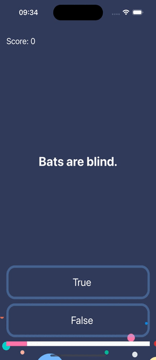

#  Quizzler Swift App

## What was do in this app

The simple a trivia quiz app with array of questions. In this app was used the Model View Controller (MVC) pattern. You have a questions that can be ansewered only "True" of "False". For question use object model (struct), so you can easy add ass many questions, as you want. In top of screen score value, which show correct answers count. In bottom used progress view, which how current progress of quiz. When choosing an answer to a question, while pressing the answer buttons, the button lights up green if the answer is correct and red if not. 

## What was used to make this app

* MVC pattern
* Autolayout for UI elements
* Control flow statements
* Structures and Classes
* UI elements such as UILabel, UIImageView, UIProgressView, UIStackView

> [!TIP]
## Example what the application do

